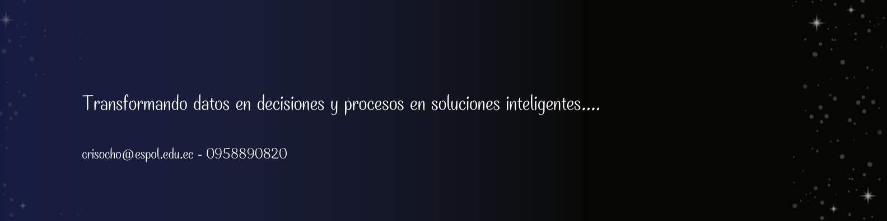

# Hola, soy Cristina Ochoa Agelvis

## 👨‍💻 Sobre mí

Soy un entusiasta de la tecnología enfocado en el análisis de datos y la automatización de procesos. Me interesa transformar datos en información útil que permita tomar decisiones más inteligentes y optimizar procesos mediante soluciones tecnológicas.

Tengo experiencia trabajando con herramientas como Power BI, SQL, Python y RPA con UiPath, desarrollando automatizaciones, modelos de datos y visualizaciones que facilitan el análisis de información.

Actualmente continúo fortaleciendo mis habilidades en análisis de datos, inteligencia de negocios y desarrollo de soluciones basadas en datos.

🚀 Intereses:
- Data Analytics
- Business Intelligence
- Automatización de procesos (RPA)
- Visualización de datos
- Desarrollo de soluciones basadas en datos

## 🛠️ Habilidades Técnicas
- Programación: C++, C#, Python
- Bases de datos: MySQL, SQL
- Sistemas: Instalación de sistemas Windows
  
## 🤝 Habilidades Profesionales

- Responsabilidad y puntualidad
- Trabajo en equipo y colaboración
- Adaptabilidad y resolución de problemas
